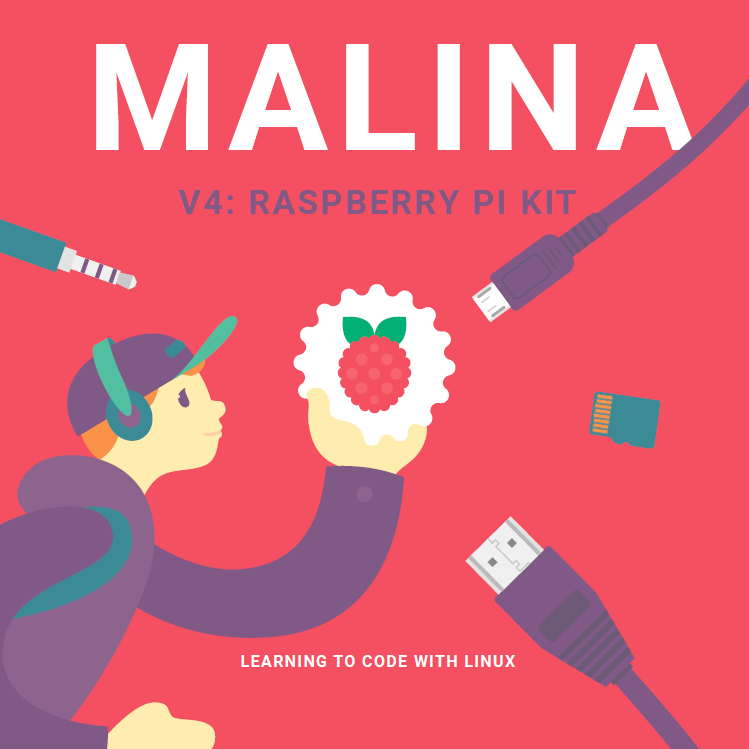

# Raspberry Kit support

Welcome to Malina V4: Raspberry kit support page. Here you can download all files necessary for our kit completion.
Also the source code for every project is provided.



## Setup

If you've got no spare monitor or keyboard you may connect Raspberry Pi via SSH, VNC and FTP protocols.
Full instruction is provided in the beginning of the book. Here are all third party programms you need for that.

## For Windows

- [Angry IP Scanner](http://raspberry.amperka.com/ipscan-3.5.5-setup.zip)
- [VNC-Viewer](http://raspberry.amperka.com/vnc-viewer-6.19.107-windows.zip)
- [FileZilla](http://raspberry.amperka.com/filezilla_3.41.2_win64_sponsored-setup.zip)

## For MacOS

- [Angry IP Scanner](http://raspberry.amperka.com/ipscan-mac-3.5.5.zip)
- [VNC-Viewer](http://raspberry.amperka.com/vnc-viewer-6.19.325-macosx-x86_64.zip)
- [FileZilla](http://raspberry.amperka.com/filezilla_3.41.2_macosx-x86_sponsored-setup.zip)

## 3. Blink

```python
import RPi.GPIO as GPIO
import time
 
GPIO.setmode(GPIO.BCM)
GPIO.setup(17, GPIO.OUT)
 
try:
    while True:
        time.sleep(0.5)
        GPIO.output(17, GPIO.HIGH)
        time.sleep(0.5)
        GPIO.output(17, GPIO.LOW)
except KeyboardInterrupt:
    print('The program was stopped by keyboard.')
finally:
    GPIO.cleanup()
    print('GPIO cleanup completed.')
```

## 4. Button

```python
import RPi.GPIO as GPIO
import time
 
GPIO.setmode(GPIO.BCM)
GPIO.setup(2, GPIO.IN)
 
while True:
    time.sleep(0.5)
    button = GPIO.input(2)
    print(button)
```

Transfer the `button` variable to the `output` function to control the LED.

```python
while (True):
    button = GPIO.input(2)
    GPIO.output(24, button)
```

Don't forget to add the pin initialization code for the output:

```python
GPIO.setup(24, GPIO.OUT)
```

Finally adding exceptions handling:

```python
import RPi.GPIO as GPIO
import time
 
GPIO.setmode(GPIO.BCM)
GPIO.setup(2, GPIO.IN)
GPIO.setup(24, GPIO.OUT)
 
try:
    while True:
        button = GPIO.input(2)
        GPIO.output(24, button)
except KeyboardInterupt:
    print('The program was stopped by keyboard.')
finally:
    GPIO.cleanup()
    print('GPIO cleanup completed')
```

## 5. Switch

```python
import RPi.GPIO as GPIO
 
GPIO.setmode(GPIO.BCM)
GPIO.setup(8, GPIO.IN)
GPIO.setup(24, GPIO.OUT)
GPIO.setup(26, GPIO.OUT)
 
try:
    while True:
        button = GPIO.input(8)
        if button == False:
            GPIO.output(24, GPIO.HIGH)
            GPIO.output(26, GPIO.LOW)
        else:
            GPIO.output(24, GPIO.LOW)
            GPIO.output(26, GPIO.HIGH)
 
except KeyboardInterrupt:
    print('The program was stopped by keyboard.')
finally:
    GPIO.cleanup()
    print('GPIO cleanup completed.')
```

## 6. LED brightness

```python
import RPi.GPIO as GPIO
import time
 
GPIO.setmode(GPIO.BCM)
GPIO.setup(18, GPIO.OUT)
pwm = GPIO.PWM(18, 1000)
dutyCycle = 50
pwm.start(dutyCycle)
 
try:
    while True:
        time.sleep(0.01)
        dutyCycle = dutyCycle + 1
        if dutyCycle > 100:
            dutyCycle = 0
        pwm.ChangeDutyCycle(dutyCycle)
 
except KeyboardInterrupt:
    print('The program was stopped by keyboard.')
finally:
    GPIO.cleanup()
    print('GPIO cleanup completed.')
```

## 7. Light control panel

```python
import RPi.GPIO as GPIO
 
 
def isPressed(btn, led):
    if GPIO.input(btn) == False:
        GPIO.output(led, GPIO.HIGH)
    else:
        GPIO.output(led, GPIO.LOW)
 

button1 = 3
button2 = 4
led1 = 14
led2 = 15
 
GPIO.setmode(GPIO.BCM)
GPIO.setup(button1, GPIO.IN)
GPIO.setup(button2, GPIO.IN)
GPIO.setup(led1, GPIO.OUT)
GPIO.setup(led2, GPIO.OUT)
 
try:
    while True:
        isPressed(button1, led1)
        isPressed(button2, led2)
except KeyboardInterrupt:
    print('The program was stopped by keyboard.')
finally:
    GPIO.cleanup()
    print('GPIO cleanup completed.')
```

## 8. Massive optimization

```python
import RPi.GPIO as GPIO
import time
 
GPIO.setmode(GPIO.BCM)
leds = [12, 13, 14, 18]
 
for led in leds:
    GPIO.setup(led, GPIO.OUT)
    GPIO.output(led, GPIO.HIGH)
 
time.sleep(3)
 
for led in leds:
    GPIO.output(led, GPIO.LOW)
 
GPIO.cleanup()
```

```python
import RPi.GPIO as GPIO
 
 
def isPressed(btn, led):
    state = 1 - GPIO.input(btn)
    GPIO.output(led, state)
 
 
leds = [12, 13, 14, 18]
buttons = [2, 3, 4, 8]
 
GPIO.setmode(GPIO.BCM)
for i in range(4):
    GPIO.setup(leds[i], GPIO.OUT)
    GPIO.setup(buttons[i], GPIO.IN)
 
try:
    while True:
        for i in range(4):
            isPressed(buttons[i], leds[i])
except KeyboardInterrupt:
    print('The program was stopped by keyboard.')
finally:
    GPIO.cleanup()
    print('GPIO cleanup completed.')
```

## 9. Web server

```python
from flask import Flask
 
app = Flask('simpleServer')
 
 
@app.route('/')
def index():
    return 'Hello, Amperka!'
 
 
app.run(port=3000, host='0.0.0.0')
```

## 10. Landing page

Web-server archive download line bellow:

```bash
wget http://raspberry.amperka.com/web-server.zip -0 web-server.zip
```

```python
from flask import Flask, send_file
 
app = Flask('landingPage')
 
@app.route('/')
def index():
    return send_file('landing.html')
 
@app.route('/images/<filename>')
def get_image(filename):
    return send_file('images/'+filename)
 
app.run(port=3000, host='0.0.0.0')
```

Sometimes following steps 8 to 12 you can get console message:  
`socket.error: [Errno 48] Address already in use`  
It means that server is still running. In this case use a command:

```bash
ps -u | grep python
```

You will get the list of all processes running. Find the line `landing.py`, check it's number in the second column and kill it with command:

```bash
kill -9 xxx
```

Where `xxx` is the number of the line.  
Then start the server again.

## 11. LED remote control

```python
from flask import Flask, send_file
import RPi.GPIO as GPIO
 
led = 18
 
GPIO.setmode(GPIO.BCM)
GPIO.setup(led, GPIO.OUT)
 
app = Flask('lightControl')
 
 
@app.route('/')
def index():
    return send_file('light.html')
 
 
@app.route('/images/<filename>')
def get_image(filename):
    return send_file('images/' + filename)
 
 
@app.route('/turnOn')
def turnOn():
    GPIO.output(led, GPIO.HIGH)
    return 'turnedOn'
 
 
@app.route('/turnOff')
def turnOff():
    GPIO.output(led, GPIO.LOW)
    return 'turnedOff'
 
try: 
    app.run(port=3000, host='0.0.0.0')
finally:
    GPIO.cleanup()
    print('GPIO cleanup completed.')
```

## 12. Feedback

```python
from flask import Flask, send_file
from flask_socketio import SocketIO
import RPi.GPIO as GPIO
 
app = Flask('feedback')
socketio = SocketIO(app)
 
btn = 2
 
GPIO.setmode(GPIO.BCM)
GPIO.setup(btn, GPIO.IN)
 
 
@app.route('/')
def index():
    return send_file('feedback.html')
 
 
@app.route('/images/<filename>')
def get_image(filename):
    return send_file('images/' + filename)
 
 
@socketio.on('isPressed')
def checkButton(receivedData):
    if GPIO.input(btn) == False:
        socketio.emit('button', 'pressed')
    else:
        socketio.emit('button', 'released')
 
 
try: 
    socketio.run(app, port=3000, host='0.0.0.0')
finally:
    GPIO.cleanup()
    print('GPIO cleanup completed.')
```

## 13. Weather phidget

```python
import requests, json
 
url = "http://api.openweathermap.org/data/2.5/forecast"
 
payload = {
    "lat": "your_city_latitude",
    "lon": "your_city_longitude",
    "units": "metric",
    "appid": "your_key",
}
 
res = requests.get(url, params=payload)
data = json.loads(res.text)
 
weather = data["list"][0]
 
 
def pars_weather(weatherType, timeRange, measurementUnits):
    if (weatherType in weather) and (
        timeRange in weather[weatherType].keys()
    ):
        print(
            weatherType,
            ": ",
            weather[weatherType][timeRange],
            measurementUnits,
        )
    else:
        print(weatherType, ": ", "none")
 
 
pars_weather("clouds", "all", "%")
pars_weather("rain", "3h", "mm")
pars_weather("snow", "3h", "mm")
print("temp:", weather["main"]["temp"], "C")
```

Our own version of weather phidget:

http://raspberry.amperka.com/weather.py

## 16. Torrents

Theese are the movies that are distributed via [CC (Creative Commons) license](https://creativecommons.org/licenses/by/4.0). That means, that one can share and adapt these materials in any way. You only have to give a credit to the original authors.

- ["BIG BUCK BUNNY"](http://raspberry.amperka.com/Big_Buck_Bunny_1080p.torrent) — a funny blender.io movie

## 17. Movie theater

OMX-web.zip link:

http://raspberry.amperka.com/omx-web.zip

## Turning on all the leds on the cloud

```python
import RPi.GPIO as GPIO
import time
 
GPIO.setmode(GPIO.BCM)
leds = [10, 12, 13, 14, 15, 16, 17, 18, 19, 21, 24, 26]
 
for led in leds:
    GPIO.setup(led, GPIO.OUT)
    GPIO.output(led, GPIO.HIGH)
 
time.sleep(3)
 
for led in leds:
    GPIO.output(led, GPIO.LOW)
 
GPIO.cleanup()
```
