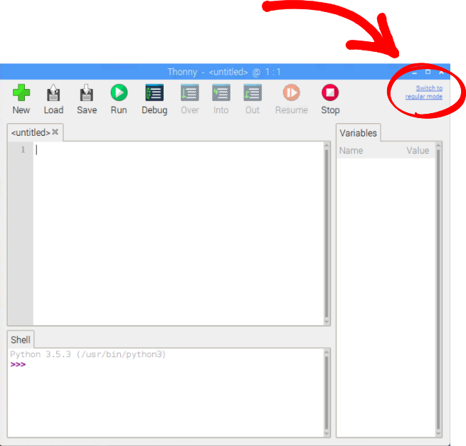
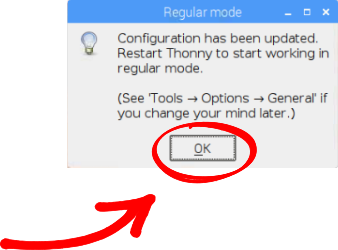
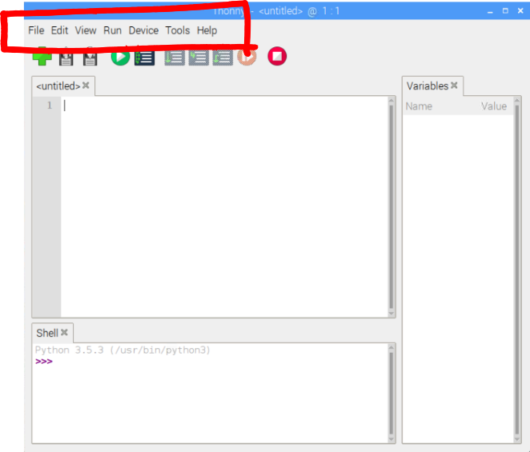
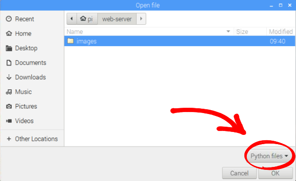
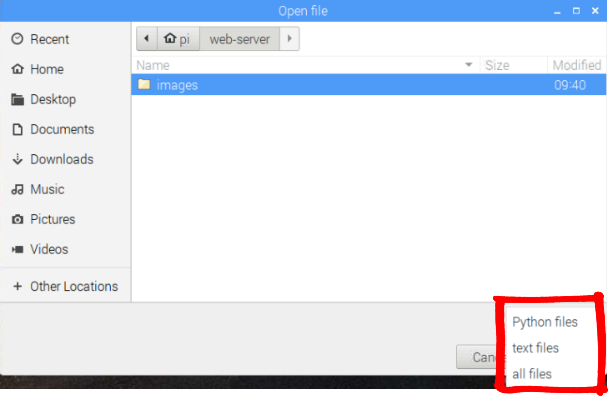
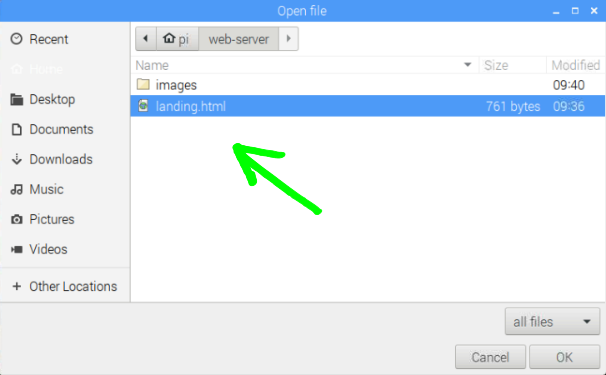

# Raspberry Kit support

Welcome to Raspberry Kit support page. Here you can download all files necessary for our Kit completion.  
Also the source code for every chapter is provided.

## Setup

If you've got no spare monitor or keyboard you may connect Raspberry Pi via SSH, VNC and FTP protocols.
Full instruction is provided starting on page 56 of the book. Here are all third party programms you need for that.

## For Windows

- [Angry IP Scanner](http://raspberry.amperka.com/ipscan-3.5.5-setup.zip)
- [Putty](http://raspberry.amperka.com/putty-64bit-0.71-installer.zip)
- [VNC-Viewer](http://raspberry.amperka.com/vnc-viewer-6.19.107-windows.zip)
- [FileZilla](http://raspberry.amperka.com/filezilla_3.41.2_win64_sponsored-setup.zip)

## For MacOS

- [Angry IP Scanner](http://raspberry.amperka.com/ipscan-mac-3.5.5.zip)
- [VNC-Viewer](http://raspberry.amperka.com/vnc-viewer-6.19.325-macosx-x86_64.zip)
- [FileZilla](http://raspberry.amperka.com/filezilla_3.41.2_macosx-x86_sponsored-setup.zip)

## Wi-Fi

Connect to Raspberry Pi via SSH.

Open the Wi-Fi configuration file using the built in text editor "Nano"  
In order to do this, enter the following line:

```python
sudo nano /etc/wpa_supplicant/wpa_supplicant.conf
```

And hit Enter.

The file will open. Add your network parameters as follows:

```python
network={
    ssid="your wi-fi name"
    psk="your wi-fi password"
}
```

Close the file using keyboard shortcut ctrl+X (cmd+X for Mac OS). Nano will ask if you want to save the changes.  
Press Y (Yes), then Enter.  
Reboot the system via command `sudo reboot`

```python
sudo reboot
```

After the reboot, disconnect the Ethernet cable and now you can control your Raspberry Pi via Wi-Fi.

## 3. Blink

When Thonny Python IDE is opened for the first time the main menu is usually hidden.  
In order to make it visible, press the link in the right corner:



Confirm changes:



Then Thonny reboots and you get the full interface:



```python
import RPi.GPIO as GPIO
import time

GPIO.setmode(GPIO.BCM)
GPIO.setup(17, GPIO.OUT)

i = 0
while (i < 5):
    i = i + 1
    time.sleep(0.5)
    GPIO.output(17, GPIO.HIGH)
    time.sleep(0.5)
    GPIO.output(17, GPIO.LOW)

GPIO.cleanup()
```

## 4. Button

```python
import RPi.GPIO as GPIO
import time

GPIO.setmode(GPIO.BCM)
GPIO.setup(2, GPIO.IN)

while (True):
    time.sleep(0.5)
    button = GPIO.input(2)
    print(button)
```

Transfer the `button` variable to the `output` function to control the LED.

```python
while (True):
    button = GPIO.input(2)
    GPIO.output(24, button)
```

Don't forget to add the pin initialization code for the output:

```python
GPIO.setup(24, GPIO.OUT)
```

## 5. Conditional expressions

```python
import RPi.GPIO as GPIO

GPIO.setmode(GPIO.BCM)
GPIO.setup(8, GPIO.IN)
GPIO.setup(24, GPIO.OUT)
GPIO.setup(26, GPIO.OUT)

while (True):
    button = GPIO.input(8)
    if (button == False):
        GPIO.output(24, GPIO.HIGH)
        GPIO.output(26, GPIO.LOW)
    else:
        GPIO.output(24, GPIO.LOW)
        GPIO.output(26, GPIO.HIGH)
```

## 6. Controlling the leds

```python
import RPi.GPIO as GPIO
import time

GPIO.setmode(GPIO.BCM)
GPIO.setup(18, GPIO.OUT)
pwm = GPIO.PWM(18, 1000)
dutyCycle = 50
pwm.start(dutyCycle)

while (True):
    time.sleep(0.01)
    dutyCycle = dutyCycle + 1
    if (dutyCycle > 100):
        dutyCycle = 0
        pwm.ChangeDutyCycle(dutyCycle)
```

## 7. Light control panel

```python
import RPi.GPIO as GPIO

def isPressed(btn, led):
    if (GPIO.input(btn) == False):
        GPIO.output(led, GPIO.HIGH)
    else:
        GPIO.output(led, GPIO.LOW)

button1 = 3
button2 = 4
led1 = 14
led2 = 15

GPIO.setmode(GPIO.BCM)
GPIO.setup(button1, GPIO.IN)
GPIO.setup(button2, GPIO.IN)
GPIO.setup(led1, GPIO.OUT)
GPIO.setup(led2, GPIO.OUT)

while (True):
    isPressed(button1, led1)
    isPressed(button2, led2)
```

## 8. Massive optimization

```python
import RPi.GPIO as GPIO
import time

GPIO.setmode(GPIO.BCM)
leds = [12, 13, 14, 18]

for led in leds:
    GPIO.setup(led, GPIO.OUT)
    GPIO.output(led, GPIO.HIGH)

time.sleep(3)

for led in leds:
    GPIO.output(led, GPIO.LOW)

GPIO.cleanup()
```

```python
import RPi.GPIO as GPIO

def isPressed(btn, led):
    state = 1-GPIO.input(btn)
    GPIO.output(led, state)

leds = [12, 13, 14, 18]
buttons = [2, 3, 4, 8]

GPIO.setmode(GPIO.BCM)
for i in range(4):
    print(i, leds[i], buttons[i])
    GPIO.setup(leds[i], GPIO.OUT)
    GPIO.output(buttons[i], GPIO.IN)

while (True):
    for i in range(4):
        isPressed(buttons[i], leds[i])
```

## 9. Making a server

```python simpleServer.py>
from flask import Flask
app = Flask('simpleServer')

@app.route('/')
def index():
    return 'Hello Amperka'

app.run(debug=True, port=3000, host='0.0.0.0')
```

## 10. Landing page

Web-server archive link bellow:

```
http://raspberry.amperka.com/web-server.zip
```

```python
from flask import Flask, send_file

app = Flask('landingPage')

@app.route('/')
def index():
    return send_file('landing.html')

@app.route('/images/<filename>')
def get_image(filename):
    return send_file('images/'+filename)

app.run(debug=True, port=3000, host='0.0.0.0')
```

Step 4 tells to open the code in the editor.  
We recommend Thonny for that. But it needs some tweaking:



Choose "All files" in the list:



Now the .html file is available. Open it:



3. Sometimes following steps 8 to 12 you can get console message:  
   `socket.error: [Errno 48] Address already in use`  
   It means that server is still running. In this case use a command:

```python
ps -fA | grep python
```

You will get the list of all processes running. Find the line `landing.py`, check it's number in the second column and kill it with command:

```python
kill -9 xxx
```

Where `xxx` is the number of the line.  
Then start the server again.

## 11. Internet light

```python
from flask import Flask, send_file
import RPi.GPIO as GPIO

GPIO.setmode(GPIO.BCM)
led = 18
GPIO.setup(led, GPIO.OUT)

app = Flask('lightControl')

@app.route('/')
def index():
    return send_file('light.html')

@app.route('/images/<filename>')
def get_image(filename):
    return send_file('images/'+filename)

@app.route('/turnOn')
def turnOn():
    GPIO.output(led, GPIO.HIGH)
    return 'turnedOn'

@app.route('/turnOff')
def turnOff():
    GPIO.output(led, GPIO.LOW)
    return 'turnedOff'

app.run(debug=True, port=3000, host='0.0.0.0')
```

## 12. Feedback

```
sudo pip3 install flask-socketio eventlet
```

```python
from flask import Flask, send_file
from flask_socketio import SocketIO
import RPi.GPIO as GPIO

app = Flask('feedback')
socketio = SocketIO(app)

GPIO.setmode(GPIO.BCM)
btn = 2
GPIO.setup(btn, GPIO.IN)

@app.route('/')
def index():
    return send_file('feedback.html')

@app.route('/images/<filename>')
def get_image(filename):
    return send_file('images/'+filename)

@socketio.on('isPressed')
def checkButton(receivedData):
    if (GPIO.input(btn) == False):
        socketio.emit('button', 'pressed')
    else:
        socketio.emit('button', 'released')

socketio.run(app, port=3000, host='0.0.0.0', debug=True)
```

Start the server with command:

```
python3 feedback.py
```

## 13. Weather widget

```python fydget.py>
import requests, json
from pprint import pprint

url = 'http://api.openweathermap.org/data/2.5/forecast'

payload = {
    'lat': 'your home city latitude',
    'lon': 'your home city longitude',
    'units': 'metric',
    'appid': 'your_key'
}

res = requests.get(url, params=payload)
data = json.loads(res.text)
weather = data['list'][0]

def pars_weather(weatherType, timeRange, measurementUnits):
    if (weatherType in weather) and (timeRange in weather[a].keys()):
        print weatherType, ': ', weather[weatherType][timeRange], c
    else:
        print weatherType, ': ', 'none'

pars_weather('clouds', 'all', '%')
pars_weather('rain', '3h', 'mm')
pars_weather('snow', '3h', 'mm')

print 'temp:', weather['main']['temp'], 'C'
```

Our own version of weather widget:

```
raspberry.amperka.com/weather.py
```

## 14. Movie theater

```
raspberry.amperka.com/omx-web.zip
```

## Turning on all the leds on the cloud

```python
import RPi.GPIO as GPIO
import time

GPIO.setmode(GPIO.BCM)
leds = [10, 12, 13, 14, 15, 16, 17, 18, 19, 21, 24, 26]

for led in leds:
    GPIO.setup(led, GPIO.OUT)
    GPIO.output(led, GPIO.HIGH)

time.sleep(3)

for led in leds:
    GPIO.output(led, GPIO.LOW)

GPIO.cleanup()
```
