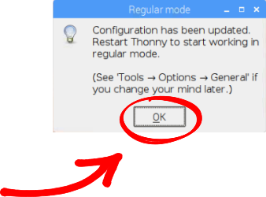
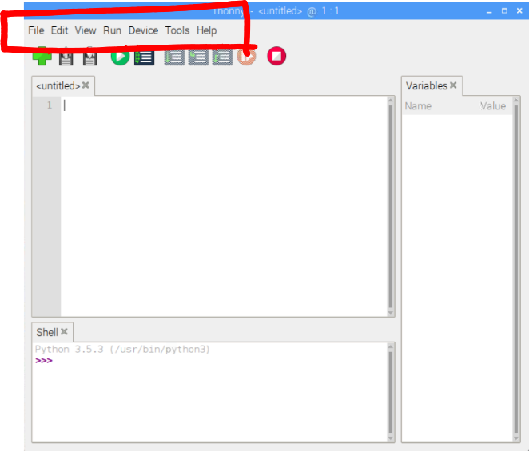
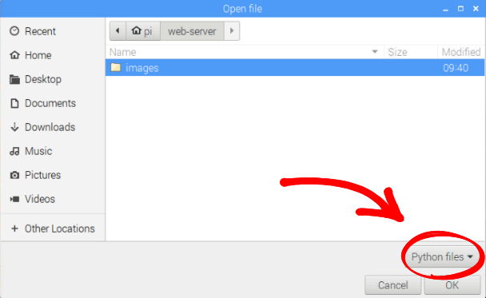
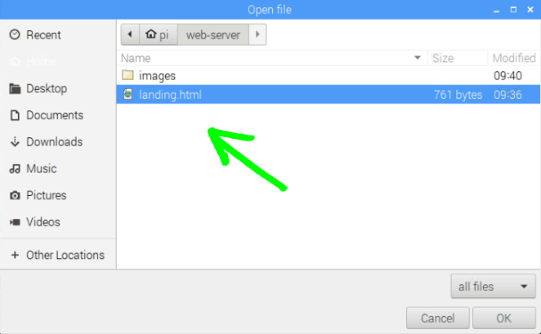

# OOPS.. You've got yourself a better Raspberry Pi! It's B+!

Good news! Fellows from Raspberry Pi Foundation managed to update their Raspberry Pi 3 Model B controller up to Model B+. It means that our book — the one you've found in the box, is somewhat obsolete, because it was published before the update

But it's no big deal!   

This patch is made precisely to fix this.   
Here you can find up to date instructions to all chapters which have to be modified.

Check up the list of the pages where the difference between models 3B and 3B+ appears.   
When you get to the listed page in the book, just look up this instruction to fix your code.

Let's get to it.

## Page 4. Raspberry Pi
Obviuosly, Raspberry Pi 3B+ looks different:


## Page 7.
Shift+alt no longer switches the language. Pity.

## Page 8. WI-FI
Nothing wrong with this one.    
Just it says that it is possible to set up Wi-Fi via SSH and doesn't say how.   
Actually SSH instruction is there, in the book on page 56. Just FYI.

## Page 25. Blink
Step 3 instruction tells the way of saving the file using graphical user interface `File -> Save As`.   
But most likely you don't see theese menus in Thonny.   
In this case follow the sequence:   
   

Confirm changes:

   

Then Thonny reboots and you get the full interface:

 

## Page 40. Landing page
Several corrections needed in this chapter.    
1. First of all in step 1 the download link for web-server.zip has been changed, because Google url shortener is discontinued. Old link may work, but we give you solid one. It is longer, but it definetly works.
Correct line would be:   
```python
wget https://raspberry.amperka.com/web-server.zip -0 web-server.zip
```

2. Step 4 tells to open the code in the editor, but doesn't say which one of them.   
We recommend Thonny for that. Like this:    

 

Choose "All files" in the list:

 

Now the .html file is available. Open it:

 

3. Sometimes following steps 8 to 12 you can get console message:    
`socket.error: [Errno 48] Address already in use`   
It means that server is still running. In this case use a command:   
```python
ps -fA | grep python
```
You will get the list of all processes running. Find the line `landing.py`, check it's number in the second column and kill it with command:
```python
kill -9 xxx
```
Where `xxx` is the number of the line.

## Page 44. Feedback
This chapter uses python version 2 in the book. That's no longer an option.   
Use Python3 to make the code work.   
In step 1 put `pip3` instead of `pip`:   
```python
sudo pip3 install flask-socketio eventlet
```
Also, few changes in the code are necessary.   
Correct code:
```python
from flask import Flask, send_file
from flask_socketio import SocketIO
import RPi.GPIO as GPIO
 
app = Flask('feedback')
socketio = SocketIO(app)
 
GPIO.setmode(GPIO.BCM)
btn = 2
GPIO.setup(btn, GPIO.IN)
 
@app.route('/')
def index():
    return send_file('feedback.html')
 
@app.route('/images/<filename>')
def get_image(filename):
    return send_file('images/'+filename)
 
@socketio.on('isPressed')
def checkButton(receivedData):
    if (GPIO.input(btn) == False):
        socketio.emit('button', 'pressed')
    else:
        socketio.emit('button', 'released')
 
socketio.run(app, port=3000, host='0.0.0.0', debug=True)
# debug=True is added in the last line
```

And finally use this line to run the server:   
```python
python3 feedback.py
```

## Page 48. Weather widget
Openweathermap.org have changed their API.   
The correct code now would be:
```python
import requests, json
from pprint import pprint
 
url = 'http://api.openweathermap.org/data/2.5/forecast'
 
payload = {
    'lat': 'your home city latitude',
    'lon': 'your home city longitude',
    'units': 'metric',
    'appid': 'your_key'
}
 
res = requests.get(url, params=payload)
data = json.loads(res.text)
weather = data['list'][0]
 
def pars_weather(weatherType, timeRange, measurementUnits):
    if (weatherType in weather) and (timeRange in weather[a].keys()):
        print weatherType, ': ', weather[weatherType][timeRange], c
    else:
        print weatherType, ': ', 'none'
 
pars_weather('clouds', 'all', '%')
pars_weather('rain', '3h', 'mm')
pars_weather('snow', '3h', 'mm')
 
print 'temp:', weather['main']['temp'], 'C'
```
Here is the substitude for goo.gl link to our version of weather widget:

```python
wget https://raspberry.amperka.com/weather.py
```

## Page 55. Autostart and schedule
There are excessive * symbols in EXAMPLES paragraph.    
Commands have 5 parameters and asterisk symbol "covers" blank spots.    
So, the lines have to look like this:   
```python
15 16 * * * python blink.py
0 10 1,16 * * python payment.py
15 7 * * 0-4 python alarm/wakeUp.py
0 */3 * * * python web-server/fidget.py
```
Every line has one * less to make 5 parameters, not 6, as you see.   
